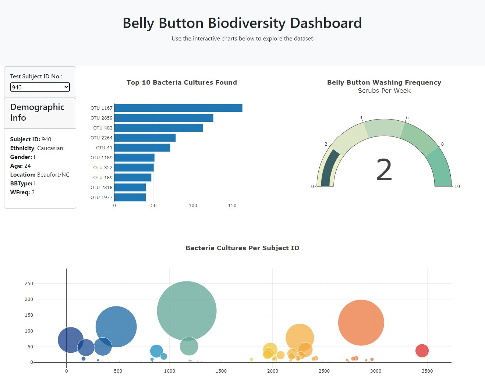

# Module 14 - Belly Button Challenge
Belly Button Challenge - Week 14 - Data Analytics Boot Camp - University of Oregon

## Background
you will build an interactive dashboard to explore the [Belly Button Biodiversity dataset](http://robdunnlab.com/projects/belly-button-biodiversity/), which catalogs the microbes that colonize human navels.

The dataset reveals that a small handful of microbial species (also called operational taxonomic units, or OTUs, in the study) were present in more than 70% of people, while the rest were relatively rare.

## Final Result

